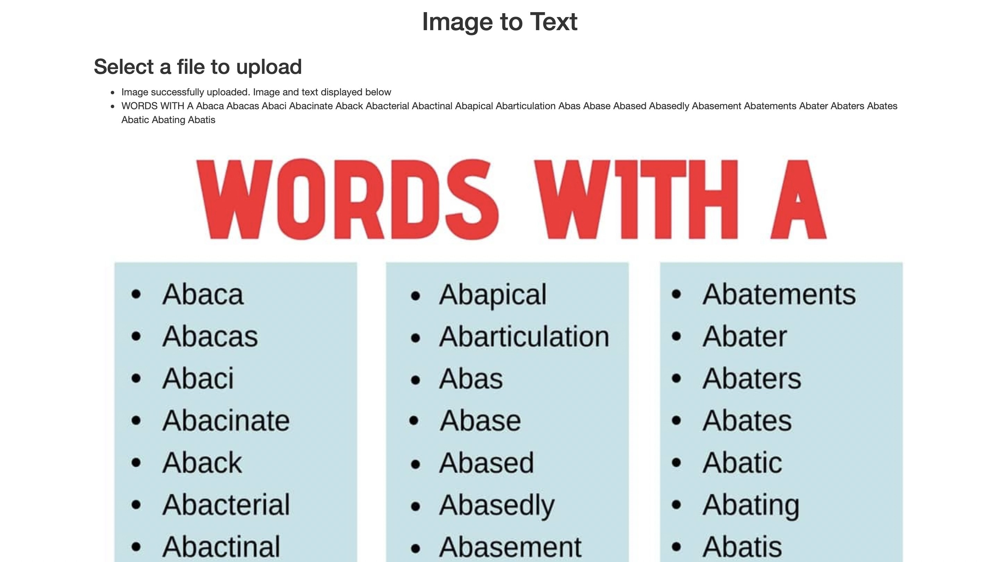
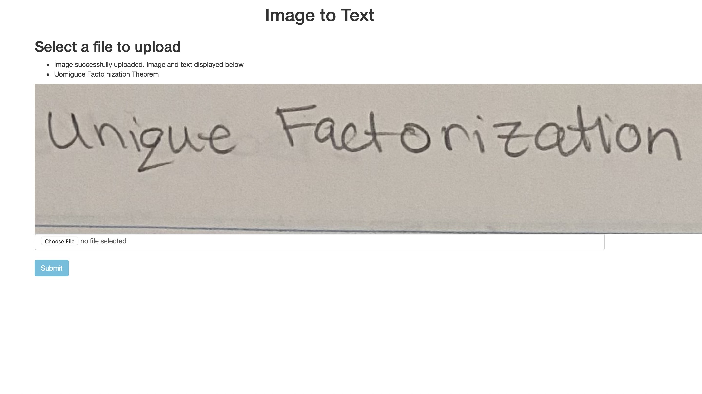
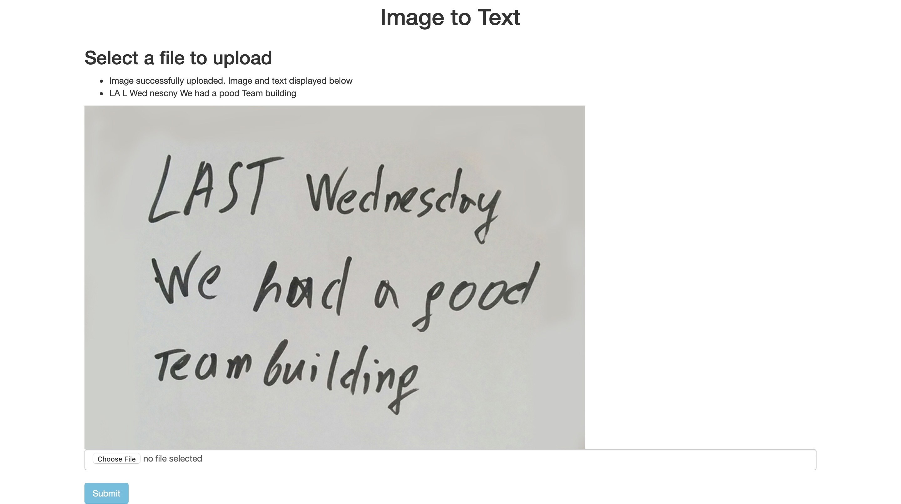

# ScanIt

## Project Startup

## After User Submits Photo

## Limitations

### With my Hand-writing

### Another Person's Hand-writing

### l's I's and /'s

## Next Steps 
Research and implement a more effective image to text translator.
Generally works fine with images from the internet where the lighting is perfect, thus, I need to incorporate more image preparation techniques before using tesseract's image to string. 
Additionally, the text is not outputted in the same format as in the image. This can be another step I can incorporate.
